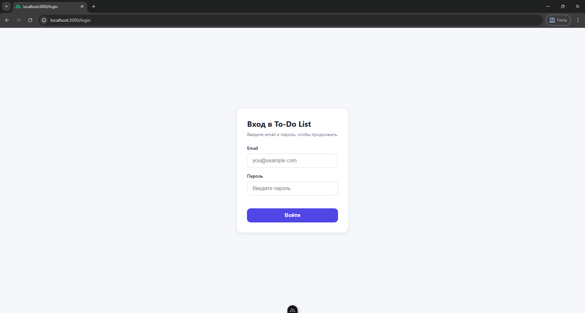
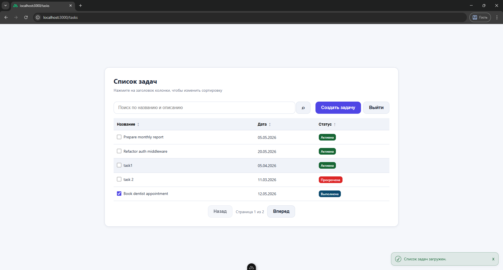
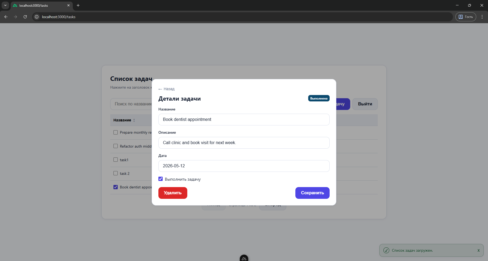
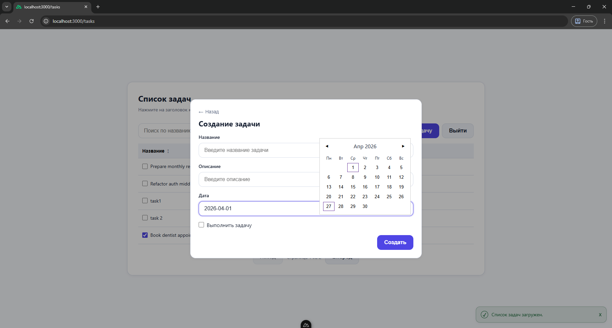

# ToDoList (Nuxt 3 + Node.js/Express)

Мини-приложение для управления задачами:
- `frontend` — интерфейс на Nuxt 3 (Vue 3)
- `backend` — REST API на Node.js + Express + TypeScript + SQLite

## Что реализовано

### Обязательная часть
- Форма входа (`email/password`)
- Хранение JWT в `localStorage`
- Автоперехват `401` (очистка токена + редирект на `/login`)
- Список задач с сортировкой
- Добавление, редактирование и удаление задач
- Базовая валидация форм
- Индикаторы загрузки (кнопки, операции с задачами, поиск)
- REST API: `GET/POST/PUT/DELETE /api/tasks`
- `POST /api/auth/login` с JWT
- SQLite-хранилище
- Обработка ошибок `400/404/500`

### Дополнительно
- Пагинация задач (backend + frontend)
- Поиск по задачам (по `title/description`)
- Статусы задач: активна / выполнена / просрочена
- Ограничение изменения/удаления: только владелец задачи
- Seed-скрипт для тестовых данных

## Технологический стек

### Frontend
- Nuxt 3
- Vue 3

### Backend
- Node.js
- Express
- TypeScript
- SQLite
- JWT (`jsonwebtoken`)
- Валидация через `zod`
- `cors`, `dotenv`, `bcrypt`

## Структура проекта

```text
ToDoList/
  frontend/
  backend/
  README.md
```

## Требования

- Node.js 20+
- npm 10+

## Установка зависимостей

```powershell
cd "C:\Users\Дарья\Desktop\Проекты\тестовые задания\ToDoList\frontend"
npm install

cd "C:\Users\Дарья\Desktop\Проекты\тестовые задания\ToDoList\backend"
npm install
```

## Настройка переменных окружения

Создайте файл `backend/.env` (можно на основе `backend/.env.example`):

```env
PORT=4000
JWT_SECRET=your_super_secret_key
DB_PATH=./data/database.sqlite
CORS_ORIGIN=http://localhost:3000
```

Описание переменных:
- `PORT` — порт backend API
- `JWT_SECRET` — ключ подписи JWT (обязателен)
- `DB_PATH` — путь к SQLite файлу
- `CORS_ORIGIN` — origin фронтенда для CORS

## Запуск проекта

### 1) Запуск backend

```powershell
cd "C:\Users\Дарья\Desktop\Проекты\тестовые задания\ToDoList\backend"
npm run dev
```

API будет доступно на `http://localhost:4000`.

### 2) Запуск frontend

```powershell
cd "C:\Users\Дарья\Desktop\Проекты\тестовые задания\ToDoList\frontend"
npm run dev
```

Приложение будет доступно на `http://localhost:3000`.

## Seed тестовых данных

Для быстрого наполнения БД добавлен скрипт `backend/src/scripts/seed.ts`.

```powershell
node --loader ts-node/esm ./src/scripts/seed.ts
```

Скрипт создает 2 пользователей и по несколько задач у каждого:
- `demo@example.com` / `secret123`
- `demo2@example.com` / `secret123`

## Формат API-ответов

Успех:

```json
{
  "success": true,
  "data": {},
  "error": null
}
```

Ошибка:

```json
{
  "success": false,
  "error": {
    "code": 400,
    "message": "Validation error"
  }
}
```

## Аутентификация

Для защищенных endpoints используется заголовок:

```http
x-access-token: <jwt>
```

JWT выдается через `POST /api/auth/login`.

## API эндпоинты

### Auth

- `POST /api/auth/login`
  - Назначение: вход пользователя (если пользователя нет, создается новый)
  - Body:
    ```json
    {
      "email": "user@example.com",
      "password": "secret123"
    }
    ```
  - Response: JWT + пользователь (`200/201`)

- `POST /api/auth/logout`
  - Назначение: выход (клиент удаляет токен)

### Tasks (требуется `x-access-token`)

- `GET /api/tasks`
  - Назначение: список задач текущего пользователя
  - Query (все опционально):
    - `status`: `all | active | completed | overdue`
    - `search`: поиск по `title/description`
    - `dueDateFrom`: дата начала диапазона
    - `dueDateTo`: дата конца диапазона
    - `sortBy`: `createdAt | dueDate | status | title`
    - `order`: `asc | desc`
    - `page`: номер страницы
    - `limit`: размер страницы (до `100`)
  - Response: массив задач + `meta` пагинации

- `POST /api/tasks`
  - Назначение: создать задачу текущего пользователя
  - Body:
    ```json
    {
      "title": "Подготовить отчет",
      "description": "Черновик и финальная версия",
      "dueDate": "2026-04-15",
      "isCompleted": false
    }
    ```

- `PUT /api/tasks/{id}`
  - Назначение: обновить задачу по `id` (только свою)
  - Body: частичное обновление (`title`, `description`, `dueDate`, `isCompleted`)

- `DELETE /api/tasks/{id}`
  - Назначение: удалить задачу по `id` (только свою)

## Быстрая проверка API

Готовые HTTP-сценарии: `backend/test.http`.

## Скриншоты

### Экран входа


### Экран списка задач


### Модальное окно редактирования задачи


### Модальное окно создания задачи

